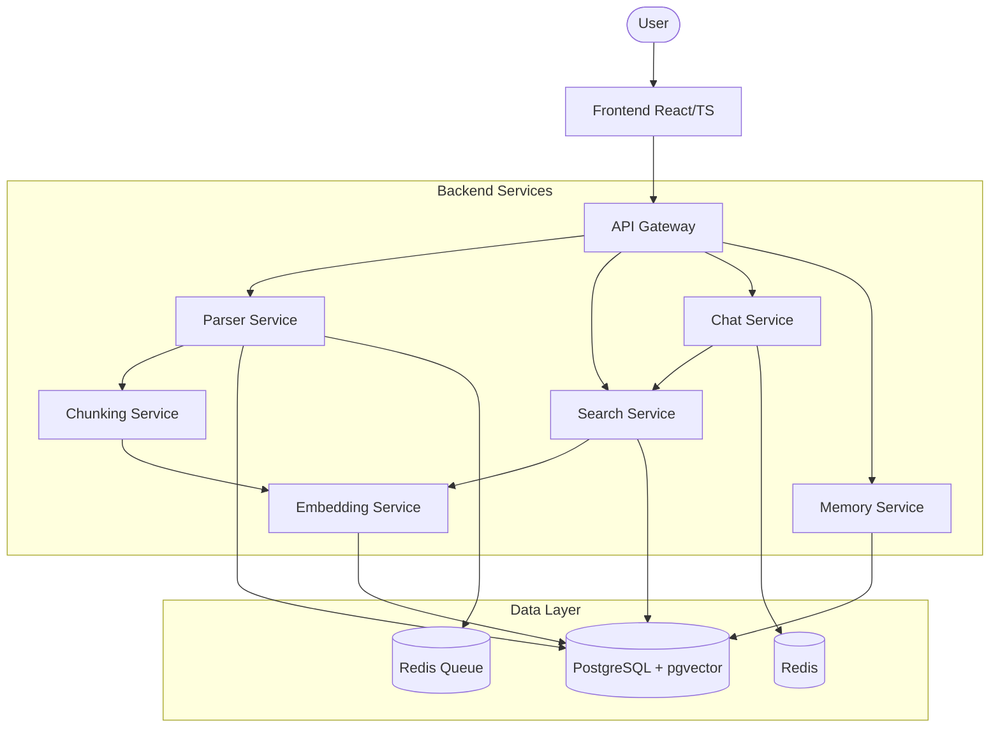

# System Architecture --- AI Developer Second Brain

## 1. Introduction
This document describes the high-level architecture of the AI Developer Second Brain system. It outlines the system components, service communication, and data flow.

## 2. System Components

### 2.1 Frontend
- **Tech Stack:** React, TypeScript, Tailwind CSS.
- **Role:** Provides the user interface for repository management, dashboard viewing, semantic search, and repository chat.

### 2.2 Backend Services (Node.js)
- **API Gateway:** Routes requests to appropriate services, handles authentication.
- **Parser Service:** Uses Tree-sitter to parse code and extract structure.
- **Chunking Service:** Splits code into meaningful chunks (functions/classes) with metadata.
- **Embedding Service:** Interfaces with LLM APIs or local models to generate vector embeddings.
- **Search Service:** Performs semantic search using pgvector.
- **Chat Service:** Handles conversational interaction, context retrieval, and response generation.
- **Memory Service:** Manages team memories, decisions, and notes.

### 2.3 Infrastructure
- **PostgreSQL + pgvector:** Stores relational data (repos, files, metadata) and vector embeddings.
- **Redis:** Used for caching, session management, and as a message broker for queue processing.

## 3. Service Communication
- **Synchronous:** REST APIs or gRPC between services (e.g., API Gateway to Chat Service).
- **Asynchronous:** Message queues (via Redis) for heavy tasks like indexing and embedding generation.

## 4. Data Flow

### 4.1 Repository Indexing Flow
1. User requests to import a repository via the Frontend.
2. API Gateway validates the request and queues it for processing.
3. Parser Service picks up the job, clones the repo, and parses code using Tree-sitter.
4. Chunking Service splits the parsed code into logical chunks.
5. Embedding Service generates vectors for each chunk.
6. Data is stored in PostgreSQL/pgvector.

### 4.2 Search Flow
1. User submits a natural language query.
2. Search Service calls Embedding Service to embed the query.
3. Search Service performs similarity search in pgvector.
4. Results are returned to the user with citations.

## 5. Architecture Diagrams

### 5.1 High-Level Component Diagram

