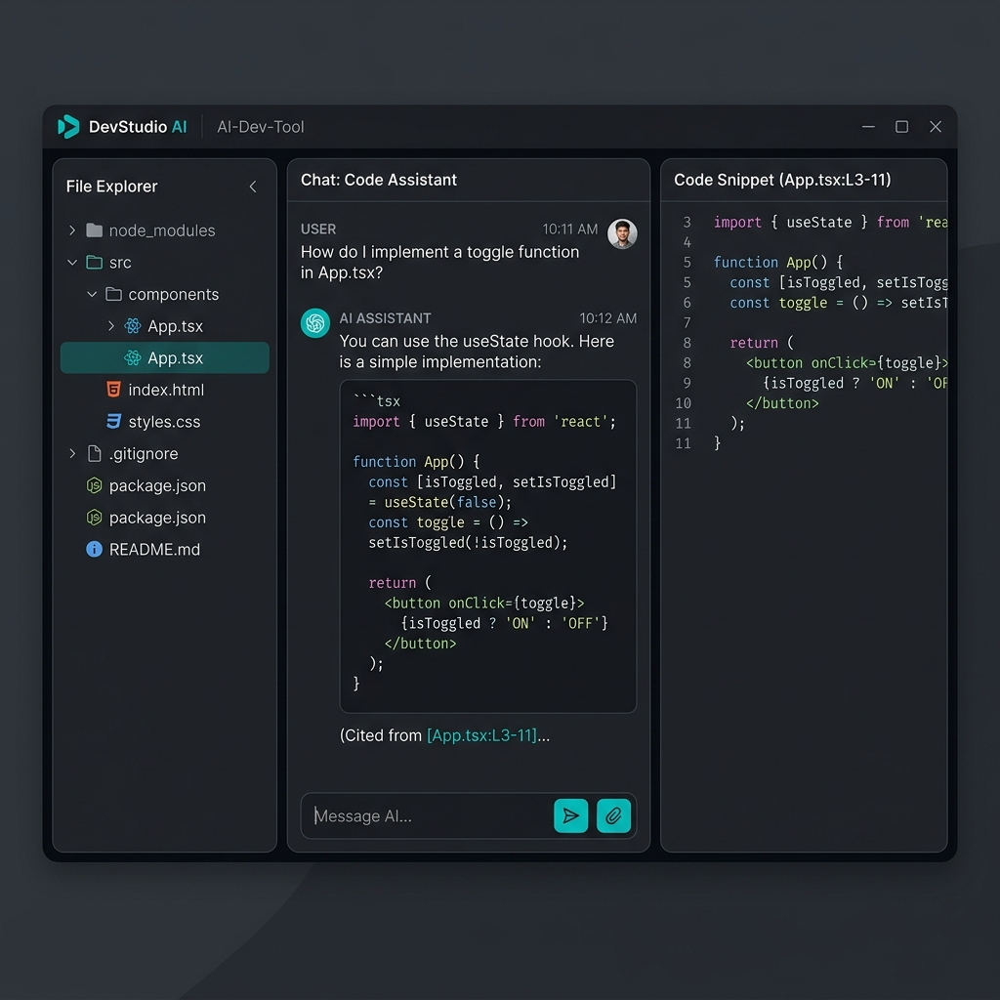

# Wireframes --- AI Developer Second Brain

## 1. Introduction
This document presents the wireframes for the AI Developer Second Brain user interface. These wireframes illustrate the layout and key components of the main views defined in the UI Specification.

## 2. Main Workspace (Repository Chat & Explorer)
This is the primary view where users spend most of their time interacting with the repository.

### Layout Breakdown:
- **Left Sidebar:** A collapsible file tree that allows users to browse the repository structure.
- **Center Pane:** The conversation area. It shows messages from the user and responses from the AI. Citations are displayed inline.
- **Right Pane:** A code viewer that displays the specific chunk of code being discussed or cited in the chat.

### Visual Mockup:

## 3. Dashboard Wireframe (Description)
While not pictured above, the Dashboard follows a clean grid layout:
- **Top Bar:** Search bar for repositories and a "New Repository" button.
- **Main Area:** Cards for each repository showing name, language, status (e.g., "Indexing", "Ready"), and a button to open the chat.
